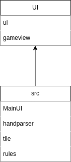
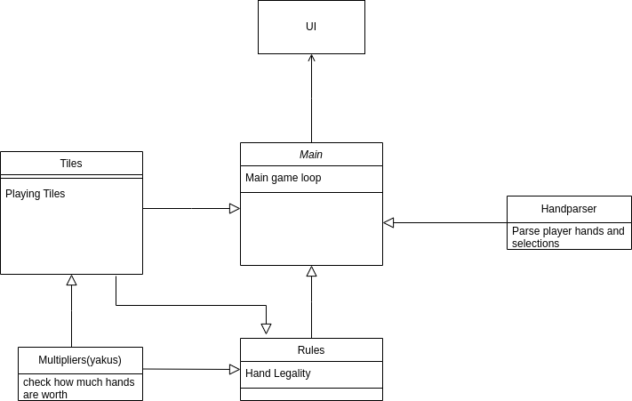
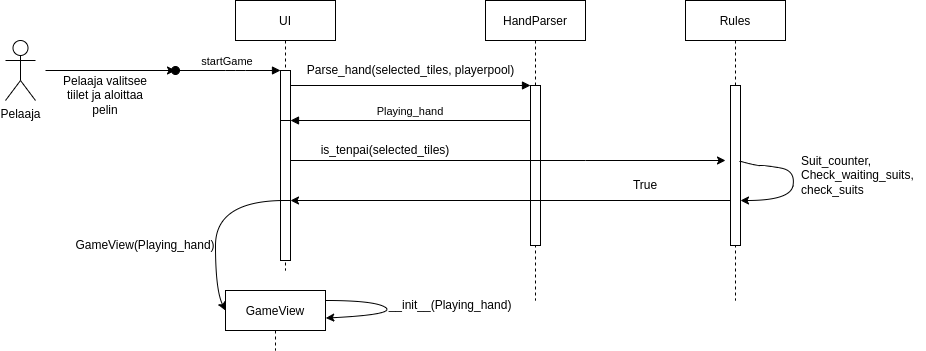

# Arkkitehtuurikuvaus

Ohjelmassa on seuraavanlainen kaksitasoinen kansio hierarkia:

Kansiossa UI on UIn pääluokka sekä gameview. päähakemistossa src on pelin logiikan hallitsevat tiedostot handparser,tile ja ui sekä pelin pääluokka mainui.

## sovelluslogiikka

Sovelluksen logiikan muodostaa luokat Rules, HandParser sekä Tiles. Tiles luokka vastaa tiilien generoinnista ja luokasta saa myös tarvittaessa tiedon eri tiilistä.
HandParser vastaa käsien tietotyypin PlayingHand muodostamisesta.
Luokka Rules sisältää pelin sääntöjen tarkistuksen ja on pelin isoin luokka. Se saa tarvittavat tiilet luokasta Tiles.
Luokka UI/ui vastaa varsinaiseti pelin yhteenkasaamisesta. Se käsittelee pelaajan syötteet ja tekee tarvittavat tarkistukset kutsumalla luokkia HandParser, Rules ja Tile.

## käyttöliittymä

Pelissä on kaksi näkymää:
- pelin aloitusnäkymä
- pelin varsinainen näkymä

tiedosto mainui käynnistää pelin uin.
UI luokat generoivat omilla funktiollansa UI näkymän niille annetuiden parametrien perusteella. Sovelluslogiikka on pyritty eristämään mahdollisimman paljon pelin varsinaisesta logiikasta ja UI luokka lähinnä parsii saatuja funktiokutsuja yhteen.

## Päätoiminnallisuus

Seuraavassa kuvaus mitä tapahtuu kun pelaaja on valinnut tiilensä ja painaa pelin aloitusnappia:

Koodin kutsuessa __startGame__ kutsuu UI luokan HandParser komentoa __parse_hand__ parametreilla jossa on kutsutut tiilet ja pelaajan saatavilla olevat tiilet. Tämän jälkeen palautetaan UIlle Playing_hand. Tämän jälkeen UI tarkistaa Rules luokalta onko käsi yhden päässä voitossa kutsumalla __is_tenpai__ parametrillä jossa on valitut tiilet. Tämän jälkeen luokka Rules tekee omat tarkistukset ja palauttaa True jos käsi on valmis, False jos ei ole. Koodin saadessa True kutsuu UI luokkaa __Gameview__ ja luo sinne uuden näkymän antamalla sille parametriksi __Playing_hand__.

## heikkoudet

Sääntöjen tarkistukseen tehty luokka rules on turhan raskas. Monia funtkiota olisi voinut jakaa toiseen tiedostoon ja osa funktioista on turhan pitkiä.
