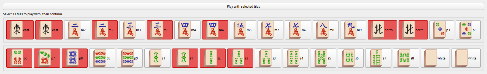
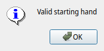
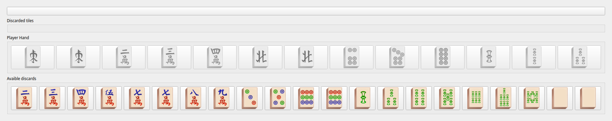
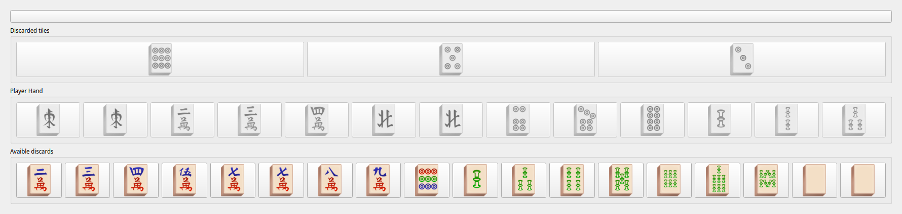

# käyttöohjeet

## Poetry komennot
Asenna projekti ajamalla:
```
poetry install
```

Voit ajaa projektin ajamalla:
```
poetry run invoke start
```
Voit ajaa UI version ajamalla:
```
poetry run invoke startui
```

### kehityskomennot

testit ajetaan komennolla:
```
poetry run invoke test
```
Testikattavuusraportin saa ajamalla:
```
poetry run invoke coverage-report
```
pylintin saa vastaavasti:
```
poetry run invoke pylint
```

## Pelaaminen

### aloitus
Muista lukea [Säännöt](./saannot.md) tarkemmasta kuvauksesta pelin toiminnasta.

Pelin aloitusnäkymässä sinun pitää valita 13 tiiltä ohjeiden mukaan. Kun olet valinnut 13 tiiltä sinun pitää painaa aloita peli painiketta.

|  |
| --- |
| __kuvassa yksi esimerkki laillisesta aloituskädestä__ |

Kun olet valinnut laillisen käden peli sanoo:



### varsinainen peli

kun olet painanut ok tulee eteesi seuraavanlainen näkymä:



Player hand näyttää sinun valitsemasi tiilet. Niiden alapuolella Avaible Discards, joista voit valita mieleisesi tiilen jonka heittää pois. Voit heittää tiiliä pois klikkaamalla niitä.

|  |
| --- |
| Esimerkki pelinäkymästä kun tiiliä on heitetty pois |
