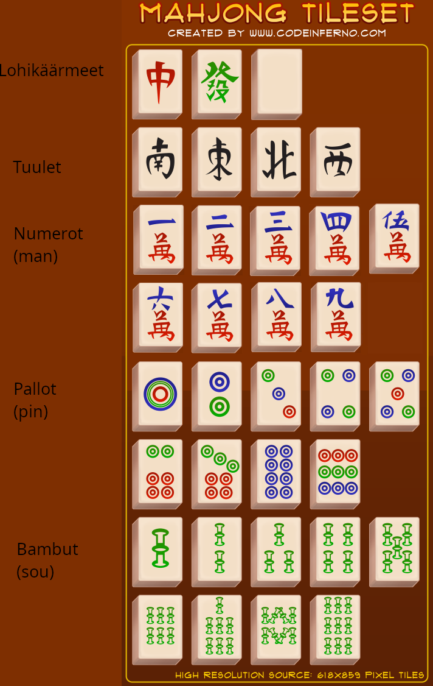
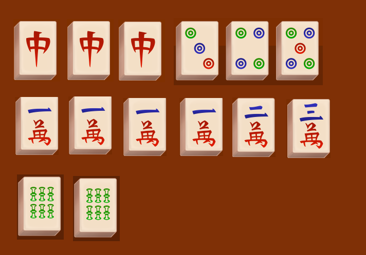
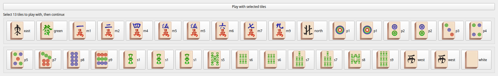

# Säännöt
## pelin tavoite
Miinakenttä mahjong on kahden pelaajan peli, missä tavoitteena on muodostaa annetuista tiilistä käsi ja voittaa toisen pelaajan poisheittämistä tiilistä.

## Tiilet
Pelissä on käytössä seuraavanlaiset tiilet:

Jokaista yksittäistä tiiltä on yksi kappale. bambuja,palloja sekä numeroita on luvuista 1-9 (katso kuva). (huom. Koodissa numerotiiliä kutsutaan maneiksi (m), palloja pineiksi (pin),ja bambuja souksi (s). Tämä johtuu tiilten alkuperäisistä nimistä).

lohikäärmeitä on punainen, vihreä sekä valkoinen.

Tuulia on kuvan järjestyksessä etelä, itä, pohjoinen sekä länsi.

## pelin kulku
pelin alussa on tarkoitus valmistaa käsi, joka on yhden päässä voitossa. käsi koostuu 4 kappaleesta settejä ja parista. Setti voi olla joko kolme samaa tiiltä tai 3 peräkkäistä tiiltä (esim. p2-p3-p4 tai north-north-north). Pari voi olla mitkä tahansa kaksi tiiltä. huomaa että 1-9 ei mene takaisin toisiinsa kiinni, eli esimerkiksi m9-m1-m2 ei ole laillinen setti.

|  |
|--- |
| __esimerkki valmiista kädestä__ |

Pelin alussa jaetaan 34 tiiltä muurista(kaikki mahdolliset tiilet * 4) tämän jälkeen pelaaja valitsee käden joka on yhden päässä valmiista kädestä. Kun pelaaja on valinnut mieleisensä valmiin käden, peli voi alkaa. 

|  |
| --- |
| __esimerkki mahdollisesta aloitusasemasta__ |

kun pelaaja on valinnut mieleisensä 13 tiiltä, peli voi alkaa.
Tämän jälkeen pelaajat heittävät heidän jäljellä olevista 21 tiilestä pois, kunnes joku vastustajan tiilistä täydentää yhden pelaajan omista käsistään tai kunnes molemmat pelaajat ovat pois tiilistä.
