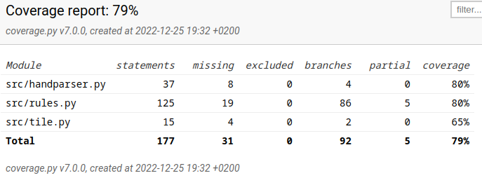

# Testidokumentti
Ohjelmaa on testattu pythonin unittest kirjastolla automaatiotasolla.
Järjestelmätestaus on tehty manuaalisesti. Ohjelmaa on testattu sekä arch linuxsilla tiling window managerilla sekä yliopiston etätyöpöydällä cubblilla.

## automaattinen testaus

Ohjelmassa on testattu luokkia Handparser, Rules ja Tiles epäsuorasti.

Handparserista testataan käsien parsimista ja discardaamista, taas sen puoleen printhandia ja inittiä niiden reduntattiuden sekä mahdollisen modulaarisuuden vuoksi vastaavasti.

Rules luokassa testataan erilaisia komentoja kun suit_splitter sekä check_winning_tiles, sen sijaan testaamatta jäi yksi isommista komennoista is_tenpai. Lisäksi olisi ollut hyödyllistä testata ohjelmaa isommalla kasalla erilaisia skenaarioita, mitkä saattavat aiheuttaa erilaisia virheitä.

## Coverage

ohjelmasta on jätetty testien ulkopuolella UI luokat, sekä mainui sen pienen kokonsa vuoksi.

ohjelman haarautumakattavuus on 79%:

## Manuaalinen testaus

ohjelmaa on testattu sekä Arch linuxilla tiling window managerille sekä Cubbli linuxilla etätyöpöydässä missä on perinteinen Desktop Manager. Molemmissa tilanteissa UI skaalaa vallanmainiosti, ja nappeja pystyy painamaan. Missään kohtaa ei ilmennyt ongelmaa minkä takia ohjelma olisi sammunut. Yhtenä isona puutteena jäi ettei ohjelma automaattisesti sammuta itseään jos tiilet loppuvat kesken. vastaavasti joskus voi käydä niin huono tuuri, että alussa ei ole mahdollista muodostaa laillista kättä. Nämä molemmat tosin ovat enemmän suunnittelusta johtuvia puutteita eikä varsinaisia virheitä.

## ongelmat
Monissa funktiossa ei ole tällä hetkellä turvallisuutta, vaan olettavat että niille on syötetty oikeaa informaatiota aikaisempien tulosten pohjalta. 

Myös enemmällä manuaalisella testauksella olisi voinut keksiä enemmän erilaisia "epätavallisia käsimuodostelmia" millä olisi voinut testata eri Rules luokan funktioita tarkemmin.
